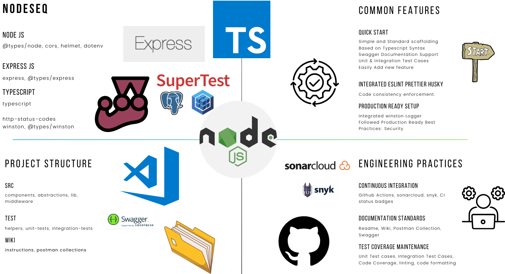

<h1 align="center"><a href="https://blog.santoshshinde.com/how-to-use-sequelize-with-typescript-node-js-and-postgresql-c6ff58a3af76" target=”_blank”>NodeSeQ</a></h1>

Node boilerplate with secure code analysis and quality checks

  
  
  
  
   
  

## Common Features

- Quick start
    - Simple scaffolding based on Typescript syntax
    - Easy global environment configuration and error handling
    - Flexible for adding new features

- Continuous Integration
    - Added Github Action Workflow
        - [sonarcloud.io](https://sonarcloud.io/summary/new_code?id=santoshshinde2012_node-ts-sequelize-pg-boilerplate)
        - [snyk.io](https://app.snyk.io/org/santoshshinde2012/project/ab175098-8886-4b72-bb5f-dce28d098fc0)
        - [CodeQL](https://codeql.github.com/)
        - [njsscan](https://opensecurity.in/#engineering) is a static application testing (SAST) tool that can find insecure code patterns in your node.js applications
        - [Codeclimate](https://codeclimate.com/)
          - 
          - 

- Documentation Standards
    - Swagger documentation support and Postman collections
    - Clear instructions in the readme file

- Test Coverage Maintenance
    - Comprehensive test coverage with eslint, prettier, and husky integration

- Production Ready Setup 
    - Followed best practices for security and efficiency
    - Integrated Winston Logger and included only necessary npm modules
  

## Core NPM Module

- [x] `express`, `@types/express`
- [x] `@types/node`
- [x] `typescript`
- [x] `dotenv`
- [x] `cors`
- [x] `helmet`
- [x] `http-status-codes`
- [x] `winston`
- [x] `sequelize`, `pg`, `pg-hstore`

## Start The application in Development Mode

- Clone the Application `git clone https://github.com/santoshshinde2012/node-ts-sequelize-pg-boilerplate.git`
- Install the dependencies `npm install`
- Start the application `npm run dev`
- To run the test cases `npm run test`

### Pre requisite 

- To run this app on a local machine, make sure the PostgreSQL database is set up and running. If not, you can use Docker and execute the following command to run the database:
    `npm run db:up`

## Start The application in Production Mode

- Install the dependencies `npm install`
- Create the build `npm run build`
- Start the application `npm run start`
- Before starting make sure to update your `.env` values for your refrence just check `.env.example`

## Project Structure

| Name                              | Description |
| --------------------------------- | ----------- |
| **docker/**                       | Docker related config for postgresql db     |
| **wiki/**                         | You can add project documentation and insructions file here |
| **src/**                          | Source files |
| **src/abstractions**              | Abstarct classes and Interfaces  |
| **src/components**                | REST API Components & Controllers  |
| **src/database**                  | Database config and models  |
| **src/lib**                       | Reusable utilises and library source code like a logger|
| **src/middleware/**               | Express Middlewares like error handler feature |
| **build/**                        | Compiled source files will be placed here |
| **tests/**                        | Test cases will be placed here |
| **tests/helpers/**                | Helpers for test cases will be placed here  |
| **tests/unit-tests/**             | Unit Test cases will be placed here  |
| **tests/integration-tests/**      | API routes (Integration) Test cases will be placed here|

## Postman Collections

The [Postman Collections](https://elements.getpostman.com/redirect?entityId=10883620-12e0cb07-b34f-4110-9b0d-00bad75fdde5&entityType=collection) is available in public workspace.

## Swagger API Documentation

The swagger documentation is available at the following url `${host}/docs`:  

[http://localhost:8080/docs](http://localhost:8080/docs)

## Wiki 

- [NodeSeQ](https://github.com/santoshshinde2012/node-ts-sequelize-pg-boilerplate/wiki)
  

## Refrences 
- [How to Use Sequelize with TypeScript, Node.js, and PostgreSQL](https://blog.santoshshinde.com/how-to-use-sequelize-with-typescript-node-js-and-postgresql-c6ff58a3af76)
- [Skeleton for Node.js Apps written in TypeScript (with Setup Instructions for ESLint, Prettier, and Husky)](https://blog.santoshshinde.com/skeleton-for-node-js-apps-written-in-typescript-444fa1695b30)
- [Global Error and Response Handler in Node JS with Express and Typescript](https://blog.santoshshinde.com/global-error-and-response-handler-in-node-js-with-express-and-typescript-913ec06d74b3)
- [Testing with Jest in TypeScript and Node.js for Beginners](https://blog.santoshshinde.com/beginners-guide-to-testing-jest-with-node-typescript-1f46a1b87dad)
- [Static Code Analysis for Node.js and TypeScript Project using SonarQube](https://blog.santoshshinde.com/static-code-analysis-for-node-js-and-typescript-project-using-sonarqube-8f90799add06)
- [Visualization of Node.js Event Emitter](https://blog.santoshshinde.com/visualization-of-node-js-event-emitter-4f7c9fe3a477)
- [NodeSeQ Demo](https://youtu.be/qyI0E_yYQik?si=KNFfqB1h7_ZlqAi0)  

### Connect with me on

  
  
   
  

