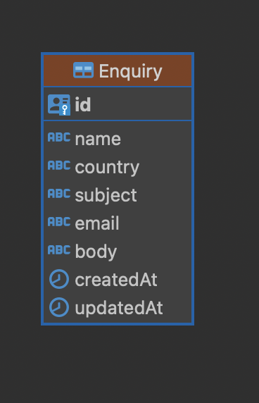

## Documentation

### Define Requirements

- Need to develop node js an app that offers common functionality for node js apps.
- Create REST API

### Technogy Stack Selection and Engineering Practice

- Primary
    - Node JS and Expreess JS
    - Typescript
    - Logger
        - Winston
- Testing
    - Jest
- Dtabase
    - PostgreSQL
    - ORM - Sequelize
- Git
    - Github
    - Github Action
- Code Quality and Vulnerability Scan
    - Snyk (Local snyk CLI)
    - Sonarqube (Local sonarlint)

### Database Design
- Entity
    - Enquiry
- Mapping

- ER Diagram

    

### Design API endpoints

- Enquiry: An Enquiry is a master entity that has a set of properties.

    - GET `/v1/enquiries` Get a list of all enquiries.
    - POST `/v1/enquiries` Create a new Enquiry.
    - GET `/v1/enquiries/{id}` Get details of a specific Enquiry.
    - PUT `/v1/enquiries/{id}` Update details of a specific Enquiry.
    - DELETE `/v1/enquiries/{id}` Delete a specific Enquiry.

### Develop an API server

- Database
    - Created a Models folder to place the database model, and it is based on sequelize.
    - Extracted config from the .env variable and exported from the `index.ts` file
- Components
    Components are divided into two parts: `Controller` and `Service` and The service is responsible for communicating with the respective database model.
- Routes
    - Register the controller and its register method for REST endpoints.
- Common Services
    - This service is accountable for performing common operations between multiple database models.
    - We can inject this into the component service and access its method in the controller from the component service.
- Unit Test Cases
    - Created unit test cases using Jest with 90+ code coverage.
    - Tried to cover positive and negative scenerio
    - Code Coverage Report
    - Sonar Cloud Scan

### Step 1: Setup PostgreSQL and Create Database

Create a `Dockerfile.postgis` file in the folder `docker/postgresql` with the below script.

```
FROM postgres:latest

# Install PostGIS extension
RUN apt-get update \
    && apt-get install -y postgis postgresql-12-postgis-3 \
    && apt-get clean \
    && rm -rf /var/lib/apt/lists/*

# To execute some initial queries, we can write queries in init.sql
COPY init.sql /docker-entrypoint-initdb.d/

# Enable PostGIS extension
RUN echo "CREATE EXTENSION IF NOT EXISTS postgis;" >> /docker-entrypoint-initdb.d/init.sql
```

Create a `docker-compose.yml` file in the folder `docker/postgresql` with the below script.

```
# docker-compose.yml for PostgreSQL

version: '3.8'

services:
  db:
    build:
      context: .
      dockerfile: Dockerfile.postgis  # Use custom Dockerfile
    restart: always
    environment:
      POSTGRES_USER: user1
      POSTGRES_PASSWORD: user1@123
      POSTGRES_DB: database
    healthcheck:
      # this command checks if the database is ready, right on the source db server
      test: [ "CMD-SHELL", "pg_isready" ]
      interval: 5s
      timeout: 5s
      retries: 5
    ports:
      - "5432:5432"
    volumes:
      - postgres_data_v:/var/lib/postgresql/data
volumes:
  postgres_data_v:
```

Write a command to run the Docker Compose file in `package.json`.

```
"db:up": "docker-compose -f docker/postgresql/docker-compose.yml up",
"db:down": "docker-compose -f docker/postgresql/docker-compose.yml down"
```

### Step 2: Installation and Configuration Sequelize

[Getting Started](https://sequelize.org/docs/v6/getting-started/) - Sequelize is available via npm (or yarn)

```
npm install --save sequelize
npm install --save pg pg-hstore # Postgres
```

Define the database connection in the `index.ts` file in the `src/database/config` folder, and we are using the `dotenv` npm module to get the environment variable. You can modify your environment-based logic as per your use case.

```
import path from 'path';
import dotenv from 'dotenv';

dotenv.config({
	path: path.join(__dirname, '../../.env'),
});

type DbConnection = {
	host: string;
	port: number;
	user: string;
	password: string;
	database: string;
	dbLogging: boolean;
};

const connection: DbConnection = {
	host: process.env.DB_HOST,
	port: Number(process.env.DB_PORT),
	user: process.env.DB_USER,
	password: process.env.DB_PASSWORD,
	database: process.env.DB_NAME,
	dbLogging:
		process.env.NODE_ENV === 'development' || process.env.LOG === 'true',
};

export default connection;

```

create `index.ts` file in `src/database` folder to make sequelize connection.

```
import { Dialect, Sequelize } from 'sequelize';
import connection from './config';

const { database, user, password, host, dbLogging } = connection;

const sequelizeConnection = new Sequelize(database, user, password, {
	host,
	logging: dbLogging,
	dialect: 'postgres' as Dialect,
});

export default sequelizeConnection;
```

Create a database assertion `assertDatabaseConnection` method in `src/App.ts` or in the entry file of your server application and call that method.

```
	private async assertDatabaseConnection(): Promise<void> {
		try {
			await database.authenticate();
			await database.sync();
			logger.info('Connection has been established successfully.');
		} catch (error) {
			logger.error('Unable to connect to the database:', error);
		}
	}

```

### Step 3: Create Tables(Models) using Sequelize

Define your `models` in the `src/database/models` folder; in our case, we are going to create a sample model, `Enquiry.ts`.

```
import { DataTypes, Model, Optional, UUIDV4 } from 'sequelize';
import sequelize from '../index';

interface EnquiryAttributes {
	id: string;
	name: string;
	subject: string;
	body: string;
	email: string;
	country: string;
}

interface EnquiryCreationAttributes
	extends Optional<EnquiryAttributes, 'id'> {}

class Enquiry
	extends Model<EnquiryAttributes, EnquiryCreationAttributes>
	implements EnquiryAttributes
{
	public id!: string;
	public name!: string;
	public country!: string;
	public subject!: string;
	public body!: string;
	public email!: string;

	public readonly createdAt!: Date;
	public readonly updatedAt!: Date;
}

Enquiry.init(
	{
		id: {
			type: DataTypes.UUID,
			defaultValue: UUIDV4,
			primaryKey: true,
		},
		name: {
			type: DataTypes.STRING(100),
			allowNull: false,
		},
		country: {
			type: DataTypes.STRING(100),
			allowNull: false,
		},
		subject: {
			type: DataTypes.STRING(200),
			allowNull: false,
		},
		email: {
			type: DataTypes.STRING(100),
			allowNull: false,
		},
		body: {
			type: DataTypes.STRING(400),
			allowNull: false,
		}
	},
	{
		sequelize,
		modelName: 'Enquiry',
		tableName: 'Enquiry',
		timestamps: true,
	},
);

export { Enquiry, EnquiryAttributes, EnquiryCreationAttributes };

```

### Step 4: Setup Service and Controller in components

- Components Components are divided into two parts: Controller and Service and The service is responsible for communicating with the respective database model.
- Routes - Register the controller and its register method for REST endpoints.
- Common Services - This service is accountable for performing common operations between multiple database models. We can inject this into the component service and access its method in the controller from the component service.


Create `src/components/enquiry/EnquiryService.ts` file to handle database operation for created model using sequelize.

```
import {
	Enquiry,
	EnquiryAttributes,
	EnquiryCreationAttributes,
} from '../../database/models/Enquiry';
import logger from '../../lib/logger';
import ApiError from '../../abstractions/ApiError';
import { StatusCodes } from 'http-status-codes';

export class EnquiryService {

	async getAll(): Promise<EnquiryAttributes[]> {
		try {
			const enquiries = await Enquiry.findAll();
			return enquiries;
		} catch (error) {
			logger.error(error);
			throw error;
		}
	}

	async getById(id: string | number): Promise<EnquiryAttributes> {
		try {
			const enquiry = await Enquiry.findByPk(id);
			if (!enquiry) {
				throw new ApiError('Enquiry not found', StatusCodes.NOT_FOUND);
			}
			return enquiry;
		} catch (error) {
			logger.error(error);
			throw error;
		}
	}

	async update(
		id: string | number,
		payload: Partial<EnquiryCreationAttributes>,
	): Promise<EnquiryAttributes> {
		try {
			const enquiry = await Enquiry.findByPk(id);
			if (!enquiry) {
				throw new ApiError(
					'Enquiry not found',
					StatusCodes.NOT_FOUND,
				);
			}
			const updatedEnquiry = await enquiry.update(payload);
			return updatedEnquiry;
		} catch (error) {
			logger.error(error);
			throw error;
		}
	}

	async create(
		payload: EnquiryCreationAttributes,
	): Promise<EnquiryAttributes> {
		try {
			const enquiry = await Enquiry.create(payload);
			return enquiry;
		} catch (error) {
			logger.error(error);
			throw error;
		}
	}

	async delete(id: string | number): Promise<boolean> {
		try {
			const deletedEnquiryCount = await Enquiry.destroy({
				where: { id },
			});

			return !!deletedEnquiryCount;
		} catch (error) {
			logger.error(error);
			throw error;
		}
	}
}

```

Create `src/components/enquiry/EnquiryController.ts` file to handle controller part of REST API.

```
import { NextFunction, Request, Response, Router } from 'express';
import { ReasonPhrases, StatusCodes } from 'http-status-codes';
import BaseApi from '../BaseApi';
import { EnquiryService } from './EnquiryService';
import { EnquiryAttributes } from '../../database/models/Enquiry';
import ApiError from '../../abstractions/ApiError';

/**
 * Enquiry controller
 */
export default class EnquiryController extends BaseApi {
	private enquiry: EnquiryService;
	public basePath: string = 'enquiries';

	constructor() {
		super();
		this.enquiry = new EnquiryService();
	}

	/**
	 *
	 */
	public register(): Router {
		this.router.get('/', this.getEnquiries.bind(this));
		this.router.get('/:id', this.getEnquiry.bind(this));
		this.router.post('/', this.createEnquiry.bind(this));
		this.router.put('/:id', this.updateEnquiry.bind(this));
		this.router.delete('/:id', this.delete.bind(this));
		return this.router;
	}

	/**
	 *
	 * @param req
	 * @param res
	 * @param next
	 */
	public async getEnquiries(
		req: Request,
		res: Response,
		next: NextFunction,
	): Promise<void> {
		try {
			const enquiries: EnquiryAttributes[] =
				await this.enquiry.getAll();
			res.locals.data = enquiries;
			// call base class method
			this.send(res);
		} catch (err) {
			next(err);
		}
	}

	/**
	 *
	 * @param req
	 * @param res
	 * @param next
	 */
	public async getEnquiry(
		req: Request,
		res: Response,
		next: NextFunction,
	): Promise<void> {
		try {
			const id = req.params.id;
			const enquiry: EnquiryAttributes =
				await this.enquiry.getById(id);
			res.locals.data = enquiry;
			// call base class method
			this.send(res);
		} catch (err) {
			next(err);
		}
	}

	/**
	 *
	 * @param req
	 * @param res
	 * @param next
	 */
	public async updateEnquiry(
		req: Request,
		res: Response,
		next: NextFunction,
	): Promise<void> {
		try {
			const id = req.params.id;
			const { body } = req;
			const enquiry: EnquiryAttributes =
				await this.enquiry.update(id, body);
			res.locals.data = {
				enquiry,
			};
			// call base class method
			this.send(res);
		} catch (err) {
			next(err);
		}
	}

	/**
	 *
	 * @param req
	 * @param res
	 * @param next
	 */
	public async createEnquiry(
		req: Request,
		res: Response,
		next: NextFunction,
	): Promise<void> {
		try {
			const { name, country, subject, body, email } = req.body;
			if (!name && !country) {
				throw new ApiError(
					ReasonPhrases.BAD_REQUEST,
					StatusCodes.BAD_REQUEST,
				);
			}
			const enquiry: EnquiryAttributes =
				await this.enquiry.create({ name, country, subject, body, email });
			res.locals.data = {
				enquiry,
			};
			// call base class method
			super.send(res, StatusCodes.CREATED);
		} catch (err) {
			next(err);
		}
	}

	/**
	 *
	 * @param req
	 * @param res
	 * @param next
	 */
	public async delete(
		req: Request,
		res: Response,
		next: NextFunction,
	): Promise<void> {
		try {
			const id = req.params.id;
			const status: boolean = await this.enquiry.delete(id);
			res.locals.data = {
				status,
			};
			// call base class method
			this.send(res);
		} catch (err) {
			next(err);
		}
	}
}

```


### Step 5: Create REST API for component

We need to register the routes that we defined earlier; for that, we have to make an entry in `src/routes.ts`.

```
import { Router } from 'express';
import EnquiryController from './components/enquiry/EnquiryController';

/**
 * Here, you can register routes by instantiating the controller.
 *
 */
export default function registerRoutes(): Router {
	const router = Router();

	// Define an array of controller objects
	const controllers = [
		new EnquiryController(),
	];

	// Dynamically register routes for each controller
	controllers.forEach((controller) => {
		// make sure each controller has basePath attribute and register() method
		router.use(`/v1/${controller.basePath}`, controller.register());
	});

	return router;
}

```